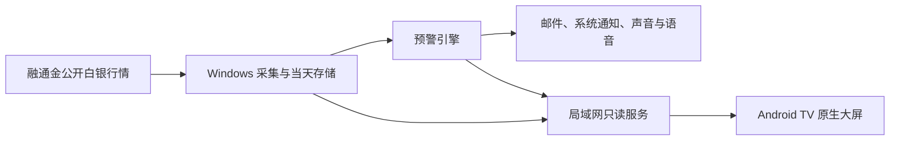

# Android TV 适配方案

状态：Windows 0.4.0 完成后再实施。本文件只确定下一阶段架构，不包含 APK。

## 推荐方向

先做“电视行情伴侣”：Windows 版继续承担融通金连接、当天数据保存、预警判断和邮件队列，电视端只显示实时价格、K 线、连接状态、AI 摘要和最近预警。这样能直接复用已经验证的核心，也不会把邮箱授权码或 DeepSeek Key放在电视上。

电视端使用 Kotlin 与 Jetpack Compose for TV 制作原生 APK。界面按横屏、远距离阅读和遥控器方向键操作设计，不能直接把桌面窗口等比缩放到电视上。

## 电视主画面

- 左侧约 35%：大号销售价、回购价、各自最高/最低、涨跌、连接状态和报价时间。
- 右侧约 65%：由真实报价生成的蜡烛图，遥控器可切换周期和查看范围。
- 底部：最近一次预警、桌面端是否在线、声音状态和 AI 摘要更新时间。
- 重要内容距屏幕边缘保留约 5% 安全区；当前焦点有明显描边、放大和颜色变化。
- 无新报价时保留最后价格，同时醒目标记“已过期”，不能伪装成实时数据。
- 长时间展示时定时轻微移动固定元素或降低亮度，减少 OLED 烧屏风险。

## 通信架构

Windows 设置中增加一个默认关闭的“允许电视连接”。开启后仅在局域网提供只读接口，首次连接使用 6 位配对码换取设备令牌。WebSocket 推送实时报价和预警，HTTP 提供健康检查与当天 K 线快照。

电视第一阶段不允许读取或修改邮箱授权码、DeepSeek Key 和完整规则，也不允许远程停止桌面监控。接口需限制配对设备、请求频率和消息大小，并可在桌面端撤销设备。

## K 线方案

电视端使用原生 Canvas 绘图，数据来自桌面端当天真实 OHLC 聚合。这样不依赖被墙网页、第三方嵌入页面或电视 WebView，也能保证遥控器交互和长时间运行稳定。

如以后需要电脑关机后仍能查看历史，可增加一个经授权的数据服务，或把行情采集核心移植到 Android。东方财富等网页只能作为用户主动打开的历史参考，不能直接把网页抓取结果当成融通金报价。

## APK 与设备兼容

- 清单声明 TV 启动入口、横屏和不需要触摸屏，确保侧载后可从电视主页启动。
- 遥控器必须能完成页面切换、周期选择、返回和退出，所有焦点移动方向可预测。
- 首轮覆盖 1080p 与 4K，字体用实际电视距离测试，而不只看模拟器。
- 在用户电视和至少一台低内存盒子上连续运行 24 小时，检查内存、重连、时钟偏差和烧屏保护。
- 自用侧载输出签名 APK；若以后上架应用商店，再补商店素材、隐私说明和平台质量检查。

## 实施顺序

1. 在 Windows 版加入可关闭、可配对的局域网只读服务。
2. 制作 TV 原型，先完成报价、当天 K 线、断线状态和遥控器操作。
3. 联调电脑休眠、关闭、换 IP、路由器断网和恢复。
4. 加入最近预警与 AI 摘要，只传展示所需内容。
5. 完成 24 小时实机测试后再输出 APK。

实施前需要确定：电视是否必须在电脑关机时独立运行。如果必须，TV 端要复制行情采集与本地存储，开发和维护成本会明显增加。
