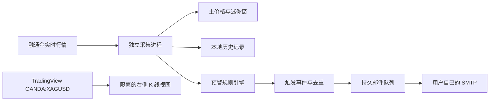

# 盛世白银·预警哨兵：产品审查与最优方案

> **实施状态更新（0.4.0）**：本报告保留了旧版问题基线和当时的方案推演。0.4.0 已改为仅使用融通金白银真实报价和当天本地 K 线，移除网页嵌入依赖与所有生产演示数据；多条件预警、邮件失败地址单独重试、声音与自定义语音、DeepSeek 联网分析、响应式主窗口和可缩放迷你窗均已完成。当前事实与实测证据以《新版变更与验证记录-0.4.0.md》和《design-qa.md》为准。

审查日期：2026-09-11  
审查对象：0.2.0 Windows 桌面版  
目标用户：持续关注融通金白银销售价/回购价，希望在符合条件时收到邮件提醒的普通使用者

## 最终判断

当前版本已经具备“真实融通金报价展示、后台采集、本地记录、邮箱配置、迷你悬浮窗、安装包”这些基础能力，但还不能被称为完整的“预警软件”。核心原因是：**邮件模块没有连接任何预警规则，打开“运行中”开关后也不会因为价格变化自动发信。**

K 线的最佳方案是：右侧改为嵌入 TradingView 官方免费 Advanced Chart，固定显示 `OANDA:XAGUSD` 国际白银现货，清楚标注“美元/盎司、OANDA 报价、TradingView 图表”。左侧融通金价格继续使用当前实时采集。两套行情用途不同，不进行强行对齐：

- 融通金销售价/回购价：用于邮件预警、迷你窗和主价格卡，单位为元/克。
- 国际白银现货 K 线：用于观察趋势和历史，单位为美元/盎司。

TradingView 将 Advanced Chart 定义为可免费嵌入的图表组件；其数据说明明确写明 Forex 数据为实时数据。`XAGUSD` 页面当前显示 OANDA 白银/美元行情。组件必须保留 TradingView 来源标识，且服务方不承诺永久无中断。[Advanced Chart 官方说明](https://www.tradingview.com/widget-docs/widgets/charts/advanced-chart/)、[数据时效说明](https://www.tradingview.com/widget-docs/faq/data/)、[XAG/USD 页面](https://www.tradingview.com/symbols/XAGUSD/)、[使用条款](https://www.tradingview.com/policies/)

## 审查范围与证据

本次采用组合审查：产品流程、界面清晰度、可靠性、可访问性和跨电脑运行。重新抓取了主面板、K 线控件、邮箱设置、收件人、系统设置和迷你窗截图；运行了当前安装包的真实行情冒烟测试；检查了源代码、生产依赖和安装包签名。

验证结果：

- 真实行情冒烟测试成功连接融通金，读取到 `JZJ_ag` 回购价和销售价并写入本地 K 线记录。
- 6 项现有自动测试全部通过。
- 生产依赖的 npm 安全公告查询结果为 0 个已知漏洞。
- 两个 0.2.0 安装文件均未进行 Windows 代码签名。
- 未再次发送真实测试邮件，避免向已配置收件人产生新的外部邮件；用户已经确认邮件实际可以发送。
- 本次交互截图使用隔离的演示配置，没有读取或展示用户真实邮箱授权码。

### 功能核对表

| 功能 | 核对方式 | 结果 |
|---|---|---|
| 安装包启动 | 当前打包版冒烟测试 | 通过 |
| 融通金白银连接 | 真实网络连接与报价读取 | 通过 |
| 销售价、回购价、日高低、涨跌 | 真实数据结构与主界面检查 | 通过 |
| 断线自动重连 | 自动测试与代码路径 | 通过；缺少面向用户的延迟秒数 |
| 本地行情保存与跨日读取 | 自动测试 | 通过 |
| 当前自绘 K 线 | 代码、界面和真实冒烟记录 | 能生成，但没有安装前历史 |
| K 线周期和范围按钮 | 隔离界面交互 | 控件可切换；数据仍受本地历史限制 |
| 图表缩放、十字线、重置 | 代码路径与界面 | 已实现基础操作；没有历史拖动与分页 |
| TradingView 白银 K 线 | Electron 联网实测 | 1 分钟和 5 分钟均加载成功 |
| 发件邮箱配置 | 隔离界面与代码检查 | 通过 |
| SMTP 连接测试 | 用户实际使用结果 + 代码检查 | 用户确认可用；本次未重新连接真实账号 |
| 添加、编辑、删除收件人 | 隔离界面与代码检查 | 通过；缺少停用和重复检查 |
| 测试邮件 | 用户实际使用结果 + 代码检查 | 用户确认已发送成功；本次未再次发送 |
| 自动价格预警 | 全代码检索 | 未实现 |
| 发送记录 | 隔离界面与代码检查 | 仅测试成功记录，信息不完整 |
| 主窗口关闭后后台运行 | 生命周期和托盘代码检查 | 已实现 |
| 迷你悬浮窗 | 当前重新渲染与代码检查 | 通过；多屏恢复需加强 |
| 始终置顶与固定位置 | 设置流程和代码检查 | 已实现 |
| 开机启动 | 代码与打包方式检查 | 安装版路径合理；便携版存在失效风险 |
| 打开数据目录、打开行情源 | 受限 IPC 和固定地址检查 | 已实现；本次未打开外部窗口 |
| 退出并停止监控 | 进程关闭流程检查 | 已实现，最长等待约 5 秒后强制结束采集进程 |
| 生产依赖安全公告 | npm 官方审计端点 | 0 个已知生产依赖漏洞 |
| Windows 代码签名 | 两个发行文件签名检查 | 均未签名 |

## 用户流程逐步审查

### 1. 启动与行情连接 — 基本健康

主面板能快速给出连接状态、更新时间、市场状态、销售价、回购价、日高低和涨跌幅。真实安装包冒烟测试确认行情连接和本地写入可用。上涨使用红色、下跌使用绿色，并同时使用箭头与正负号，不只依赖颜色表达方向。

问题：界面只写“行情连接正常”，没有显示当前价格是否已经过期。网络中断后虽然内部会重连，但用户更需要看到“最后一笔报价距现在多少秒”。

证据：[主面板截图](audit-2026-09-11/01-main.png)

### 2. 主面板信息架构 — 可用，但导航具有误导性

左右分栏符合用户的核心关注顺序：左侧价格和通知，右侧趋势。价格尺寸醒目，邮件状态也一直可见。

问题：顶部“实时行情、数据监控、邮件通知”看起来像会切换页面，实际点击只会让目标区域短暂变亮，没有页面切换、滚动或功能展开。用户会认为按钮失效。建议保留“实时行情”作为当前页，其余入口分别打开“预警管理”和“邮件设置”；系统设置继续打开对话框。

品牌图标仍是“金”，迷你窗也是“金”，与只监控白银的定位不一致，应统一为 `Ag`。

### 3. 当前本地 K 线 — 功能不完整

现有 K 线不是固定图片，但它只能把软件启动后记录到的融通金价格变化聚合成 1、5、15、30、60 分钟蜡烛。刚安装时没有历史；选择 7 天或 30 天也不会自动获得过去数据。它每 5 秒重新读取并聚合，历史多时会逐渐变慢。

“报价活跃度”柱体统计的是记录条数，不是交易成交量。这个命名目前是诚实的，不能改成“成交量”。

核心限制：只在价格发生变化时记录，因此无法形成规范秒线；查询还会在 50,000 条后截断，30 天视图可能不完整。

证据：[当前 K 线筛选截图](audit-2026-09-11/04-kline-controls.png)

### 4. 免费真实 K 线候选 — TradingView 通过实测

本次在相同 Electron 环境里实际加载了 `OANDA:XAGUSD`。5 分钟和 1 分钟配置都能显示真实蜡烛、历史区间、OHLC 和 ticks 活跃度。图表原生支持缩放、拖动、十字光标、指标和周期选择，明显优于现有自绘图。

证据：[5 分钟实测截图](audit-2026-09-11/08-tradingview-xagusd.png)、[1 分钟实测截图](audit-2026-09-11/09-tradingview-1m.png)

数据含义必须准确：XAG/USD 是国际白银现货报价，Forex/贵金属现货不存在全世界唯一价格；这里展示的是 OANDA 数据源的真实报价。它不是融通金销售价，也不是上海期货交易所白银期货。

免费版本应承诺“1 分钟及以上”。TradingView 主站确实提供秒级周期，但官方价格表把秒级历史放在付费等级，免费嵌入组件也没有明确承诺秒线，因此本软件不能把秒线写成免费功能。[秒级周期说明](https://www.tradingview.com/support/solutions/43000762068/)、[价格与历史限制](https://www.tradingview.com/pricing/)

备选数据：COMEX 白银期货 `SI1!` 更接近交易所成交，但 TradingView 的 CME 免费公开数据延迟 10 分钟，适合作为可选参考，不适合默认“实时”K 线。[市场数据覆盖](https://www.tradingview.com/data-coverage/)

### 5. 邮箱设置 — 基础能力健康

发件邮箱、SMTP、465/587 端口、授权码和连接测试的结构清晰。授权码使用 Windows 系统加密保存，界面不回显明文。收件人支持备注、编辑、删除；测试邮件发送成功后会显示时间和收件人。

问题：

- 邮件总开关允许在没有规则时显示“运行中”，含义错误。
- 连接失败和发送失败没有完整写入持久日志；当前只有测试邮件成功才写记录。
- 收件人数据中存在启用/停用字段，界面却没有单独开关。
- 没有重复邮箱检查，也没有常见邮箱服务的快速配置说明。
- 邮件设置、收件人和预警规则应该分层：邮箱是发送通道，收件人是联系人，规则决定何时发送。

证据：[发件邮箱设置](audit-2026-09-11/05-email-settings.png)、[添加收件人](audit-2026-09-11/06-add-recipient.png)、[通知开关状态](audit-2026-09-11/07-mail-toggle-state.png)

### 6. 预警流程 — 当前缺失，属于最高优先级

当前代码没有规则表、规则编辑器、价格判断、冷却时间、去重状态或邮件队列。行情变化只会保存数据，不会调用发信逻辑。用户现在能完成“邮箱测试”，但无法完成产品的主任务“价格达到条件后自动通知”。

建议第一版只做用户最需要、最容易理解的三类价格规则：

1. 价格到位：销售价或回购价高于/低于指定数值。
2. 金额变化：与 X 分钟前相比，上涨/下跌至少 Y 元/克。
3. 比例变化：与 X 分钟前相比，上涨/下跌至少 Y%。

之后再增加“突破 X 分钟最高/最低”“买卖价差”“连续上涨/下跌”和“行情断线”。TradingView 的成熟提醒也把价格穿越、上穿/下穿、金额移动和百分比移动作为常见操作符，并允许用户决定触发频率；这套心智模型适合本软件。[预警条件说明](https://www.tradingview.com/support/solutions/43000763312-learn-how-to-configure-alerts/)、[触发频率说明](https://www.tradingview.com/support/solutions/43000474415-differences-between-alert-frequencies/)

### 7. 迷你悬浮窗 — 视觉合格，边界情况不足

迷你窗能同时显示回购、销售、涨跌和连接状态，尺寸适合长期置顶。主面板隐藏后后台继续运行，方向正确。

问题：固定位置按鼠标所在显示器计算，不等于用户明确选择的显示器；更换显示器或分辨率后，记住的坐标可能落到屏幕外。悬浮窗尺寸完全固定，125%/150% 系统缩放下可能显得太小。图标仍为“金”。

证据：[迷你悬浮窗](audit-2026-09-11/03-mini-window.png)

### 8. 系统设置与后台运行 — 部分健康

后台运行、置顶、固定位置、记住位置和开机启动入口都已存在，设置结构清楚。

严重边界问题：便携版内部使用 `process.execPath` 注册开机启动，而 electron-builder 便携包会先解压到临时目录运行。官方为此提供了 `PORTABLE_EXECUTABLE_FILE` 环境变量。当前便携版的自启动路径可能指向临时可执行文件，重启后失效。安装版路径稳定；便携版应使用该环境变量，或直接不提供开机启动。[electron-builder 便携版说明](https://github.com/electron-userland/electron-builder/blob/master/website/docs/nsis.md)

证据：[系统设置](audit-2026-09-11/02-system-settings.png)

### 9. 跨电脑分发 — 能运行，但还不够稳妥

安装版和便携版均已生成，文件约 111 MB，当前只提供 Windows x64。没有代码签名，其他电脑可能出现 Windows SmartScreen 的未知发布者提示。还需要验证 Windows 10、Windows 11、125%/150% 缩放、双屏和受限网络。

邮箱授权码使用本机 Windows 加密，不能把配置文件直接复制到另一台电脑继续使用；这是正确的安全行为，但需要在说明里告诉用户：换电脑后必须重新输入邮箱授权码。预警规则可以导出导入，授权码不应导出。

### 10. 可访问性 — 有基础，但图表和小控件需改进

优点包括明显的键盘焦点样式、原生表单标签、方向箭头和文字状态。主要问题是自绘 K 线只有画布，没有可供键盘或读屏读取的 OHLC 表格；部分 9–10px 辅助文字过小；图标按钮主要依赖图标和 `title`；固定最小宽度 1180px，低分辨率和放大显示时缺乏重排。

本次没有使用读屏软件逐项验证，因此不能声称符合完整 WCAG 标准。

## 最优产品结构

这里最关键的隔离原则是：**嵌入 K 线只负责看图，绝不作为预警判断的数据源。** 跨域嵌入内容无法也不应该被软件抓取；预警始终使用左侧融通金实时销售价/回购价。

Electron 官方建议远程内容使用隔离的 `WebContentsView`，关闭 Node 集成、开启上下文隔离和沙箱、拒绝权限、限制导航与新窗口。不要为了嵌入图表而放宽主界面的安全策略。[Electron 安全清单](https://www.electronjs.org/docs/latest/tutorial/security)、[WebContentsView](https://www.electronjs.org/docs/latest/api/web-contents-view)

TradingView 会为组件正常运行处理嵌入页面地址、组件类型、品种和 IP，官方说明组件不设置 Cookie。软件的隐私说明应写明这一点。[组件常见问题](https://www.tradingview.com/widget-docs/faq/general/)

## 预警规则的最佳交互

主面板左下角建议改名为“预警与邮件”，顶部显示三段真实状态：

- 行情：正常 / 已中断 N 秒
- 邮箱：已连接 / 未配置 / 连接失败
- 规则：N 条启用 / 暂无规则

没有规则时，不显示笼统的“运行中”，而显示：

> 邮箱已配置，但还没有预警条件。创建规则后，价格达到条件才会发送邮件。

新建规则使用一句话构造器：

> 当【销售价】在【5 分钟】内【上涨金额】达到【0.100 元/克】时，通知【张先生、交易提醒】，冷却【30 分钟】。

每条规则卡片显示：启用状态、条件、当前进度、收件人、最近触发时间和下一次可触发时间。示例：`当前上涨 0.062 / 目标 0.100`。

规则必须包含这些防刷屏机制：

- 边沿触发：条件从“不成立”变为“成立”时只发一次。
- 冷却时间：默认 30 分钟，可选 5 分钟、15 分钟、30 分钟、1 小时、仅一次。
- 复位区间：价格必须退出条件区间后才能再次触发。
- 每日上限：单条规则默认每天最多 10 封。
- 断线保护：行情过期、刚重连、缺少完整观察窗口时不触发变化类规则。
- 重启去重：每个触发事件有唯一编号，软件重启后不重复发送同一事件。

邮件内容应同时写明：规则名称、触发时间、触发价格、基准价格、金额变化、百分比变化、观察窗口、销售/回购类型、行情源和数据时间。这样用户不必重新打开软件才知道为什么收到邮件。

## 优先级清单

| 优先级 | 问题 | 处理方式 |
|---|---|---|
| P0 | 没有自动预警规则 | 建立规则编辑器、规则引擎、事件日志和邮件队列 |
| P0 | 邮件“运行中”状态失真 | 状态由行情、邮箱和启用规则共同决定 |
| P0 | K 线没有历史支撑 | 嵌入 `OANDA:XAGUSD` TradingView 免费图表 |
| P1 | 两套白银价格容易混淆 | 永久显示来源和单位；K 线标题写“国际白银现货参考” |
| P1 | 便携版开机启动可能失效 | 使用 `PORTABLE_EXECUTABLE_FILE` 或在便携版禁用自启动 |
| P1 | 发信无重试、失败日志不足 | 持久队列、退避重试、失败原因和手动重发 |
| P1 | 安装包未签名 | 正式外部分发前购买代码签名证书并签名 |
| P2 | 顶部导航像失效按钮 | 改为真正入口或移除伪导航行为 |
| P2 | 多屏与缩放边界不足 | 恢复窗口时校正到可见工作区并支持缩放档位 |
| P2 | 品牌仍使用“金”图标 | 主窗口、托盘、迷你窗全部改为 `Ag` |
| P2 | 图表和小文字可访问性弱 | 增加当前蜡烛文字摘要、键盘标签、提高最小字号 |

## 推荐实施顺序

### 0.3.0：把核心承诺做完整

1. 用隔离的 `WebContentsView` 嵌入 TradingView `OANDA:XAGUSD`，保留来源标识，增加加载失败与重新加载状态。
2. 删除当前伪历史 K 线主视图；本地融通金记录继续保留，供预警计算和审计使用。
3. 实现价格到位、金额变化、百分比变化三类规则。
4. 增加边沿触发、冷却、复位、每日上限和断线保护。
5. 将邮件状态改成“通道状态 + 规则状态”，增加触发日志和失败日志。

### 0.3.1：可靠性与跨电脑

1. 邮件持久队列、失败重试、重启去重。
2. 修复便携版开机启动；验证双屏和系统缩放。
3. 增加规则导出/导入，不导出邮箱授权码。
4. 增加“诊断信息”页面：行情延迟、最近连接、最近规则检查、最近发信。

### 1.0.0：正式分发

1. Windows x64 安装版作为默认下载，便携版作为备用。
2. 完成 Windows 10/11 多机测试和长时间运行测试。
3. 对安装包和主程序进行代码签名。
4. 提供更新检查和清晰的版本说明。

## 0.3.0 验收标准

- 新安装后右侧 12 秒内显示真实国际白银 K 线；失败时显示来源、原因和“重新加载”。
- 能选择至少 1、5、15、30 分钟，1、4 小时，日线；能拖动查看历史。
- 图表固定为白银，标题和单位始终可见，TradingView 来源标识不被遮挡。
- 创建“销售价 5 分钟上涨 0.100 元/克”后，使用模拟行情可以只触发一次；冷却前不重复发信。
- 价格先达到条件、退出复位区间、再次达到后，才能产生第二次事件。
- 行情中断、刚重连或缺少 5 分钟基准时，不触发 5 分钟变化规则。
- 重启软件后不会重复发送已处理事件；待发送事件能够继续重试。
- 主窗口隐藏后规则继续运行；迷你窗开关与系统设置状态一致。
- 安装版开机启动有效；便携版采用稳定路径或明确不提供该选项。

## 建议保留的现有成果

不需要推倒重做。当前行情采集、自动重连、独立采集进程、本地 SQLite、Windows 安全存储、受限 IPC、主面板视觉和迷你窗都可以继续使用。下一阶段应集中在三个连接点：真实外部 K 线、融通金预警规则、可靠邮件投递。完成这三部分后，软件才真正形成“看行情—设条件—收提醒”的闭环。
