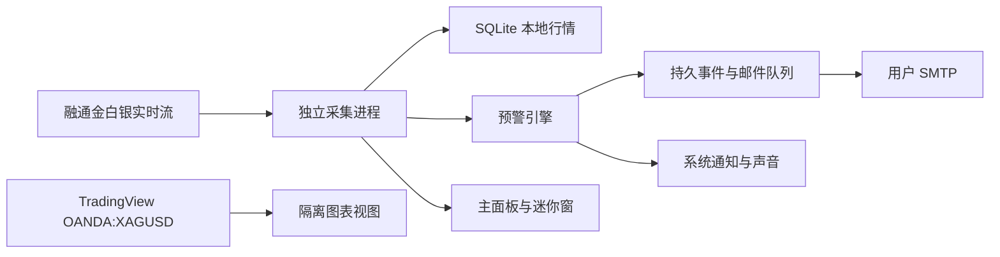

# 盛世白银·预警哨兵 0.3.0：变更与验证记录

完成日期：2026-09-11  
适用平台：Windows 10/11 x64

## 交付文件

| 文件 | 用途 | 大小 | SHA-256 |
|---|---|---:|---|
| `SilverSentinel-0.3.0-x64-setup.exe` | 安装版，适合长期使用 | 107.38 MB | `EE563D15F5022BA67325D86445EC87716EB83FD4EE43A9DA503454EBDDC540F2` |
| `SilverSentinel-0.3.0-x64-portable.exe` | 便携版，无需安装 | 107.10 MB | `F9A46DFFE84E7563F4B9323287EE0E2C3DD9916FC494FAC60EDBCF2E1CF32BE4` |

两个文件均未做商业代码签名，Windows 首次运行时可能显示未知发布者。哈希与最后一次运行结果同时保存在 `release-0.3.0/verification.json`。

## 本版完成内容

### K 线

- 右侧使用隔离的 TradingView Advanced Chart，固定为 OANDA `XAGUSD` 国际白银现货。
- 可选择 1、5、15、30 分钟，1、4 小时和日线。
- 支持拖动历史、缩放、十字光标和指标；保留 TradingView 来源标识。
- 左侧明确标注融通金元/克报价，右侧明确标注国际白银美元/盎司，避免把两套价格混为一谈。
- 图表独立于主界面运行：关闭 Node 能力、开启沙箱与上下文隔离、拒绝权限并限制跳转。

### 预警

- 支持价位、短时金额变动、短时百分比、较昨收金额/百分比、连续高于/低于、进入/离开区间、销售与回购价差。
- 金额快捷值提供 0.05、0.10、0.20、0.30 元/克，也允许自由输入。
- 单条规则最多 3 个条件，可选择“全部同时满足”或“任一条件满足”。
- 单条规则可分别选择邮件、Windows 系统通知、声音提示。
- 具备边沿触发、60% 回撤复位、冷却时间、每日上限、断线和过期行情保护、重启状态恢复。
- 旧版本的单条件规则会自动迁移；单条损坏规则会被跳过，不会阻止整个监控程序启动。

### 发送可靠性

- 触发事件和待发送邮件均持久保存。
- 邮件失败按 1、5、15、30、60 分钟退避重试，最多 5 次。
- 发送记录显示等待、重试、成功、失败、仅本地提醒和跳过原因。
- 发邮件期间若出现新预警，完成发送时会重新读取最新队列，避免旧快照覆盖新事件。
- Windows 通知点击后打开主面板；声音可设置 1、2、3 次。
- 邮箱授权码继续使用 Windows 安全存储加密。

### 窗口与使用体验

- 迷你窗默认约 270×105，可在 220×88 至 520×230 之间自由缩放。
- 可置顶、固定四角、自由拖动并记住位置和尺寸。
- 主面板提供 85%、90%、100%、110% 显示比例；窗口过小时自动采用更合适的比例，放大后恢复用户选择。
- 主窗口最低为 980×700，并记住位置、尺寸和最大化状态。
- 主面板关闭后继续在托盘运行；退出入口明确为“退出并停止监控”。
- 安装版与便携版均可开机启动；便携版使用原始便携文件路径，不会注册临时解压目录。
- 应用、托盘和迷你窗统一使用 Ag 白银图标。

## 架构复核

采集进程与界面分开，界面卡顿不会直接停止行情连接；预警只使用融通金白银销售价/回购价，不读取嵌入图表。邮件设置、行情数据库和预警队列都只在主进程读写。当前 JSON 预警存储采用临时文件加原子替换，规模适合单机规则；行情明细使用按日 SQLite。

## 验证结果

| 检查项 | 结果 |
|---|---|
| JavaScript 语法检查 | 通过 |
| 自动测试 | 14/14 通过 |
| 规则种类、组合逻辑、复位、冷却、每日上限 | 自动测试通过 |
| 损坏规则不阻断启动 | 自动测试通过 |
| 二进制行情解码、乱序丢弃、断线重订阅 | 自动测试通过 |
| SQLite 写入、跨日读取、待写恢复 | 自动测试通过 |
| 最终便携版启动 | 通过，退出码 0 |
| 最终便携版真实融通金连接 | 通过；测试时回购 14.238、销售 14.338 元/克 |
| 最终便携版行情保存与 K 线聚合 | 通过 |
| 最终便携版加载安全测试规则 | 通过；阈值 999 元/克，未触发提醒 |
| TradingView 真实国际白银 K 线 | 实测成功，图表 iframe 已加载 |
| 980×700 最小窗口 | 85% 与用户选择 100% 两种场景均截图复核；100% 会自动适配 |
| 迷你窗默认与 220×88 最小尺寸 | 截图复核通过 |
| 多条件规则窗口 | 3 条条件、渠道选择和保存按钮均可见，无水平裁切 |
| 安装包生成 | 安装版与便携版均成功 |
| 文件哈希 | 已记录 |
| Windows 代码签名 | 未签名 |

本轮没有再次向真实邮箱发送测试邮件，也没有播放测试声音，以免打扰或产生外部消息。邮件发送能力已由用户先前实际确认；本版对队列、重试、规则到投递的代码路径和隔离配置进行了验证。

## 仍需现实环境验证

- 融通金公开协议并非正式开放 API；网站改变协议时需要更新采集器。
- TradingView 依赖外网和其嵌入服务，受网络环境与服务可用性影响。
- 正式大量分发前应购买 Windows 代码签名证书，并在另一台 Windows 11、高 DPI、双显示器电脑上做一次安装与自启动实测。
- SMTP 无法提供严格的“绝不重复”：若程序在服务器已经收信但本地尚未来得及记录成功的瞬间崩溃，重启重试可能产生一封重复邮件。邮件内的触发编号可用于识别。
- Android TV 尚未制作，实施方向见《Android-TV适配方案.md》。
